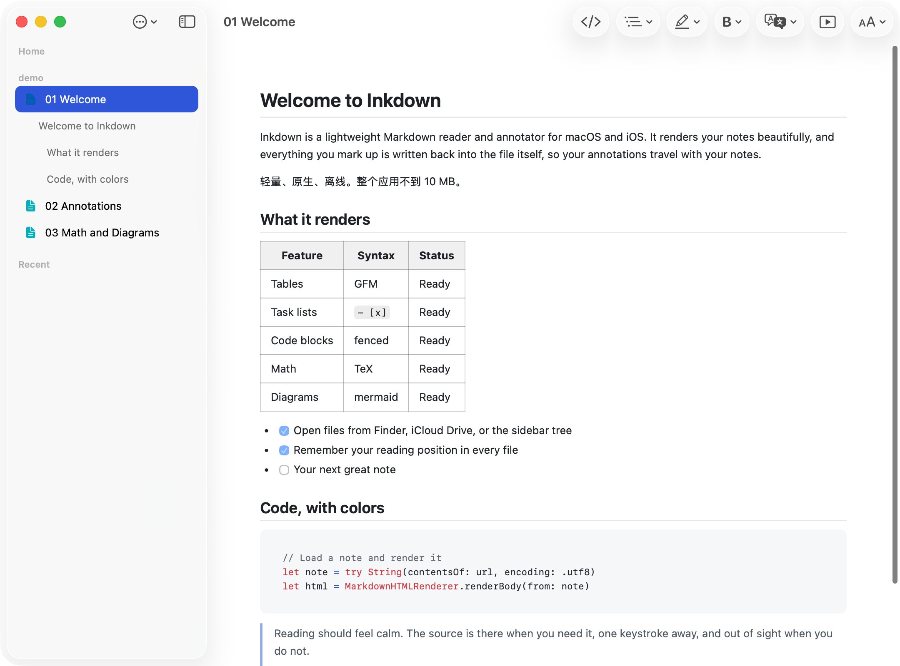
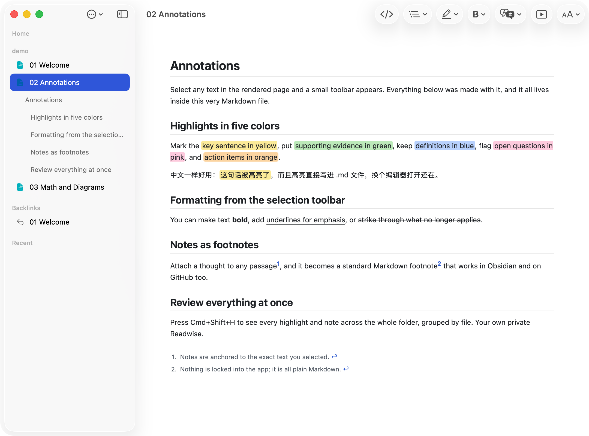
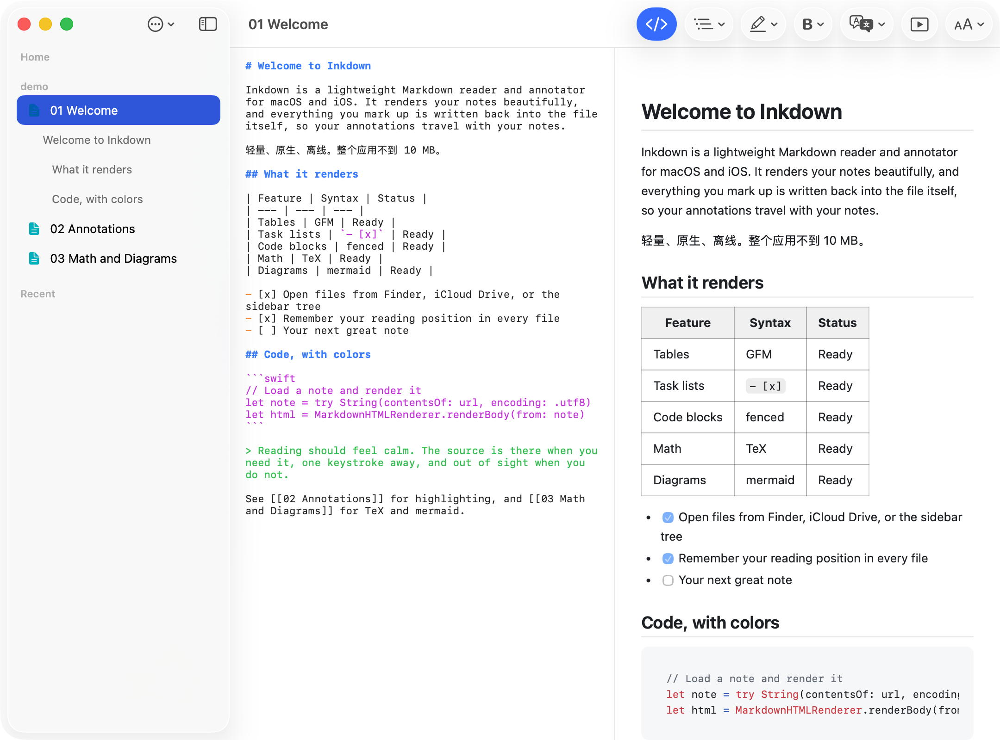
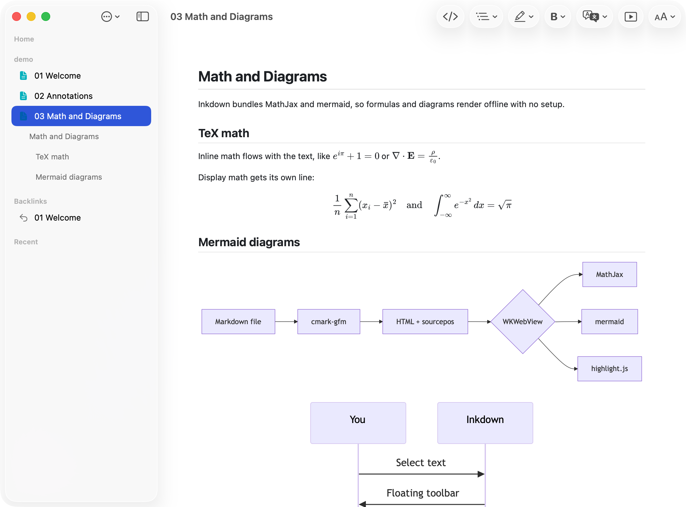

<div align="center">


# Inkdown

**Read calmly. Annotate permanently.**

A lightweight, native Markdown reader and annotator for macOS and iOS.
Everything you highlight, format, or note is written back into the `.md` file itself,
so your annotations travel with your notes.

English | [简体中文](README.zh-CN.md)

`8.8 MB app` · `100% offline` · `macOS 14+ / iOS 17+`

</div>



## Why Inkdown

Most Markdown apps are either heavyweight editors or read-only previewers. Inkdown is built around the reading loop: open a folder, read comfortably, mark what matters, and review it all later. There is no database and no lock-in; the Markdown files are the single source of truth.

## Features

### Reading

- GitHub-flavored rendering: tables, task lists, footnotes, syntax-highlighted code
- TeX math (MathJax) and mermaid diagrams, bundled and fully offline
- Three themes (Default, Serif, Sepia), adjustable text size (10 to 24 pt) and page width
- Reading position remembered per file; PDF files open in a built-in viewer
- Presentation mode: slides split at `#` and `##` headings, arrow-key navigation

### Annotating



- Select text in the rendered page and a floating toolbar appears
- Highlights in five colors, bold, underline, strikethrough, one-click removal
- Notes stored as standard Markdown footnotes
- All annotations are written into the source file: `==marks==`, `<mark>` tags, `[^n]` footnotes
- **All Highlights** (Cmd+Shift+H): every highlight and note across the folder, grouped by file

### Navigating

- Sidebar with a lazy Home browser, the focused folder tree, and recents
- Heading outline auto-expands under the open file; click to jump
- Quick open (Cmd+P), folder-wide full-text search (Cmd+Shift+F)
- `[[wiki links]]` resolve to notes in the folder; a Backlinks section lists reverse links

### Translation and AI

- On-device document translation (English and Chinese) that never translates code, file names, paths, or URLs, while still translating comments inside code blocks
- Select text for instant translation, or Explain and Summarize via Apple Intelligence, fully on-device

### Editing



- Preview-first: the source editor is hidden until you press Cmd+E
- Syntax-colored editor with debounced autosave
- Rename, create, and trash files from the sidebar; open-in-place from Finder

## Math and diagrams



## Windows and Linux

A desktop port lives in [`desktop/`](desktop/), built with Tauri 2 on the system webview, so it stays just as small. It shares the same rendering pipeline (MathJax, mermaid, highlight.js, wiki links) and the annotation loop: highlights, formatting, and footnote notes written back into the file, plus quick open, folder search, themes, and reading-position memory. Windows (`.msi`), Linux (`.deb` / `.AppImage`), and macOS builds are produced by CI on every `desktop-v*` tag; grab them from [Releases](../../releases).

```bash
cd desktop
npm install
npm run dev     # requires Rust
```

## Install (macOS / iOS native app)

**Download**: a signed DMG is on its way; for now, build from source.

**Build from source** (requires Xcode 16+ and [XcodeGen](https://github.com/yonaskolb/XcodeGen)):

```bash
git clone https://github.com/lytreallynb/markreader-ios.git
cd markreader-ios
xcodegen generate
open MarkReader.xcodeproj
```

Build the `MarkReaderMac` scheme for macOS or `MarkReader` for iOS. `bash scripts/release.sh` produces a DMG in `dist/`.

## Keyboard shortcuts

| Shortcut | Action |
| --- | --- |
| Cmd+P | Quick open by file name |
| Cmd+Shift+F | Search text in folder |
| Cmd+Shift+H | All highlights |
| Cmd+E | Toggle source editor |
| Cmd+Plus / Cmd+Minus | Text size |
| Cmd+S | Save now (autosave is on) |

## Built with

SwiftUI · cmark-gfm · WKWebView · highlight.js · MathJax · mermaid · PDFKit · Translation · FoundationModels

Sample documents live in [`demo/`](demo/).
