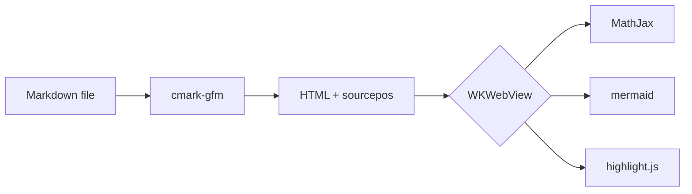
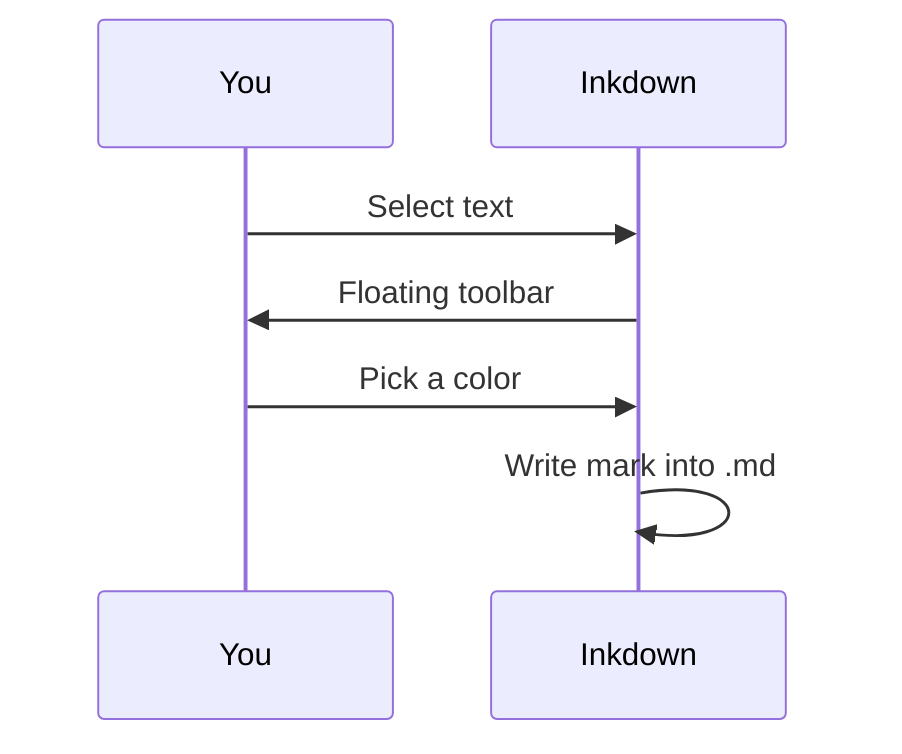

# Math and Diagrams

Inkdown bundles MathJax and mermaid, so formulas and diagrams render offline with no setup.

## TeX math

Inline math flows with the text, like $e^{i\pi} + 1 = 0$ or $\nabla \cdot \mathbf{E} = \frac{\rho}{\varepsilon_0}$.

Display math gets its own line:

$$
\frac{1}{n}\sum_{i=1}^{n} (x_i - \bar{x})^2 \quad\text{and}\quad \int_{-\infty}^{\infty} e^{-x^2}\,dx = \sqrt{\pi}
$$

## Mermaid diagrams

Everything on this page renders on-device. No network, no accounts.
